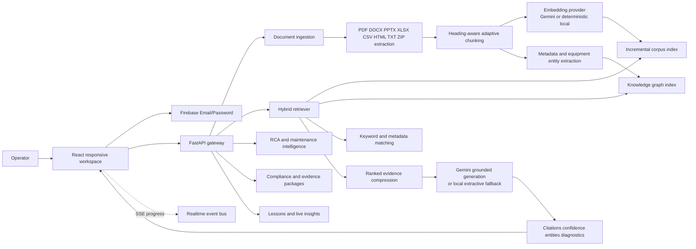

# OpsBrain AI — Submission Architecture Diagram

## Demo path

`Upload → Extract → Chunk → Embed → Index → Graph → Retrieve → Ground → Cite → Act`

The same `/api/query` contract powers Copilot and the RAG Architecture trace. The seeded corpus under `storage/documents` is synthetic validation evidence and is explicitly marked in every file.
